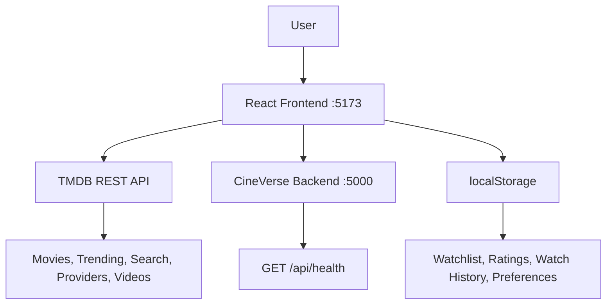

# 🎬 CineVerse — Movie Discovery & Recommendation App

A full-stack movie discovery platform that lets users explore trending films, get personalized recommendations, search using natural language, manage a watchlist, and find where to stream any movie — powered by the TMDB API.

---

## 📌 Project Overview

CineVerse is a React + TypeScript frontend application backed by a lightweight Express.js API server. Users can browse trending movies worldwide and in India, search with natural language queries (e.g. *"good Hindi thriller from 2023"*), build a taste profile through reactions and ratings, and receive personalized recommendations — all without requiring any login or account.

This project was built as an internship project to demonstrate full-stack web development skills including frontend state management, API integration, recommendation algorithms, and backend architecture.

---

## ✨ Features

- 🔍 **Movie Search** — Keyword search across the full TMDB database
- 🧠 **Natural Language Search** — Describe what you want (genre, language, decade, mood) and get matching results
- 🌍 **Trending Movies** — Worldwide trending, India trending, and Hindi trending sections
- 🎭 **Mood-Based Discovery** — Pick a mood (e.g. Thrilled, Romantic, Scared) and get matched suggestions
- 🎯 **Personalized For You** — Recommendation engine that learns from your reactions, ratings, and watch history
- 👤 **Taste Profile** — View and manage your genre preferences, watch history, liked/disliked movies, and star ratings
- 📋 **Watchlist** — Save movies locally to a personal watchlist
- 🎬 **Movie Details** — Full details: synopsis, cast & crew, trailers (YouTube), runtime, budget, revenue
- 📺 **Where to Watch** — Streaming, rent, and buy availability (TMDB Watch Providers, India region priority)
- 🇮🇳 **Indian Cinema Page** — Dedicated discovery for Indian regional cinema
- 🤖 **Movie Assistant** — Conversational assistant modal for recommendations
- 🎉 **Movie Night Planner** — Group preference matcher for picking movies everyone will enjoy
- 🔔 **Toast Notifications** — Non-intrusive feedback on watchlist actions

---

## 🏗️ Architecture

```
User Browser
    │
    ▼
Frontend (React + TypeScript + Vite)
    │  ├── Pages (Home, ForYou, MovieDetails, Watchlist, IndianCinema, TasteProfile, About)
    │  ├── Components (Navbar, MovieCard, HeroBanner, Modals, etc.)
    │  └── Services (recommendationEngine, naturalLanguageSearch, whereToWatch, preferenceStore)
    │
    ├──── TMDB API (direct from frontend via Axios)
    │       └── Search, Discover, Details, Credits, Videos, Watch Providers
    │
    └──── CineVerse Backend API (Express.js on :5000)
              └── GET /api/health
```



> **Note:** All movie data is fetched directly from TMDB on the frontend. The Express backend is structured for future expansion and currently serves a health-check endpoint.

---

## 🛠️ Tech Stack

### Frontend
| Technology | Purpose |
|---|---|
| React 19 | UI framework |
| TypeScript | Type safety |
| Vite 7 | Build tool & dev server |
| React Router DOM v7 | Client-side routing |
| Axios | HTTP requests to TMDB API |
| Vanilla CSS | Styling |

### Backend
| Technology | Purpose |
|---|---|
| Node.js | Runtime |
| Express.js 4 | HTTP server framework |
| TypeScript | Type safety |
| tsx | TypeScript execution for development |
| CORS | Cross-origin request handling |
| dotenv | Environment variable management |

### External APIs
| API | Usage |
|---|---|
| [TMDB API v3](https://developer.themoviedb.org/docs) | Movie data, search, trending, credits, videos, watch providers |

### Storage
- **Browser `localStorage`** — Watchlist, watch history, ratings, reactions, preferences (no backend database required)

---

## 📂 Project Structure

```
Movie APP/
│
├── backend/                        ← Express.js API server
│   ├── src/
│   │   ├── config/
│   │   │   └── env.ts              ← Environment config loader
│   │   ├── controllers/
│   │   │   └── health.controller.ts
│   │   ├── middleware/
│   │   │   ├── errorHandler.ts
│   │   │   └── notFoundHandler.ts
│   │   ├── routes/
│   │   │   └── health.routes.ts
│   │   ├── services/
│   │   │   └── index.ts
│   │   ├── utils/
│   │   │   └── logger.ts
│   │   └── server.ts               ← Entry point
│   ├── .env.example
│   ├── package.json
│   └── tsconfig.json
│
├── public/                         ← Static assets
│
├── src/                            ← React frontend source
│   ├── components/
│   │   ├── HeroBanner.tsx
│   │   ├── MoodSelector.tsx
│   │   ├── MovieAssistantModal.tsx
│   │   ├── MovieCard.tsx
│   │   ├── MovieNightModal.tsx
│   │   ├── NaturalLanguageSearch.tsx
│   │   ├── Navbar.tsx
│   │   ├── ReactionButtons.tsx
│   │   ├── StarRating.tsx
│   │   ├── Toast.tsx
│   │   └── WhereToWatch.tsx
│   ├── pages/
│   │   ├── About.tsx
│   │   ├── ForYou.tsx
│   │   ├── Home.tsx
│   │   ├── IndianCinema.tsx
│   │   ├── MovieDetails.tsx
│   │   ├── TasteProfile.tsx
│   │   └── Watchlist.tsx
│   ├── services/
│   │   ├── naturalLanguageSearch.ts
│   │   ├── preferenceStore.ts
│   │   ├── recommendationEngine.ts
│   │   └── whereToWatch.ts
│   ├── App.tsx
│   ├── main.tsx
│   ├── movieAPI.ts                 ← TMDB API client
│   └── types.ts                    ← Shared TypeScript types
│
├── .env.example                    ← Frontend env template (safe, no real keys)
├── .gitignore
├── eslint.config.js
├── index.html
├── package.json
├── tsconfig.app.json
├── tsconfig.json
├── tsconfig.node.json
├── vite.config.ts
└── README.md
```

---

## ⚙️ Installation

### Prerequisites
- Node.js v18+
- A free [TMDB API key](https://www.themoviedb.org/settings/api)

### 1. Clone the repository
```bash
git clone https://github.com/your-username/movie-app.git
cd movie-app
```

### 2. Set up frontend environment
```bash
cp .env.example .env
# Edit .env and set your TMDB API key:
# VITE_TMDB_KEY=your_actual_tmdb_api_key
```

### 3. Install frontend dependencies
```bash
npm install
```

### 4. Set up backend environment
```bash
cd backend
cp .env.example .env
# Defaults in .env.example work for local development
npm install
cd ..
```

---

## 🔐 Environment Variables

### Frontend (`/.env`)
```env
VITE_TMDB_KEY=your_tmdb_api_key_here
```

### Backend (`/backend/.env`)
```env
PORT=5000
NODE_ENV=development
CORS_ORIGIN=http://localhost:5173
```

> ⚠️ **Never commit `.env` files.** Both are excluded via `.gitignore`. Use the `.env.example` files as safe templates.

---

## ▶️ Running the Project

Run the **backend** and **frontend** in two separate terminals.

### Terminal 1 — Backend
```bash
cd backend
npm run dev
# Starts on http://localhost:5000
```

### Terminal 2 — Frontend
```bash
# From the project root
npm run dev
# Starts on http://localhost:5173
```

---

## 🔄 Application Workflow

```
User opens CineVerse (localhost:5173)
    │
    ├── Home → loads Worldwide / India / Hindi trending from TMDB
    │
    ├── Search → keyword or natural language query
    │              └── NL parser extracts genre, language, year → TMDB discover/search
    │
    ├── Movie Details → synopsis, cast, trailers, Where to Watch providers
    │
    ├── React / Rate / Watchlist → saved to localStorage
    │              └── updates TasteProfile & ForYou recommendations
    │
    └── For You → personalized recs + mood selector + NL search
```

---

## 📡 API Endpoints

### CineVerse Backend (`http://localhost:5000`)

| Method | Endpoint | Description |
|---|---|---|
| `GET` | `/api/health` | Health check — returns server status, timestamp, and environment |

### TMDB API (used directly by the frontend)

| Endpoint | Purpose |
|---|---|
| `GET /search/movie` | Keyword search |
| `GET /trending/movie/week` | Worldwide weekly trending |
| `GET /discover/movie` | Filtered discovery (genre, language, year, region) |
| `GET /movie/{id}` | Full movie details |
| `GET /movie/{id}/credits` | Cast & crew |
| `GET /movie/{id}/videos` | Trailers |
| `GET /movie/{id}/similar` | Similar movies |
| `GET /movie/{id}/watch/providers` | Streaming / rent / buy availability |

---

## 🧪 Testing

Automated tests are not implemented in the current version.

Manual verification:
```bash
# Backend health check
curl http://localhost:5000/api/health

# Open frontend
http://localhost:5173
```

---

## 🔒 Security Notes

- **TMDB API key** is stored in `.env` and accessed via Vite's `import.meta.env` — never hardcoded in source files
- **No user credentials** are stored — the app uses anonymous `localStorage` for all preferences
- **CORS** is configured on the backend to allow only the frontend origin (`http://localhost:5173` by default)
- `.env` files are excluded from version control via `.gitignore`

---

## 📸 Screenshots

> Add screenshots of the running application here.

| Page | Description |
|---|---|
| Home | Hero banner + trending sections + search |
| For You | Personalized recommendations + mood selector + NL search |
| Movie Details | Full info, cast, trailer, Where to Watch |
| Watchlist | Saved movies |
| Taste Profile | User preferences, history, ratings |
| Indian Cinema | Regional Indian film discovery |

---

## 🤝 Contributing

1. Fork the repository
2. Create your feature branch: `git checkout -b feature/your-feature`
3. Commit your changes: `git commit -m 'Add some feature'`
4. Push to the branch: `git push origin feature/your-feature`
5. Open a Pull Request

---

## 👨‍💻 Author

Built as an internship project demonstrating full-stack development with React, TypeScript, Node.js, Express, and TMDB API integration.

---

## 📄 License

This project does not currently include a license. All rights reserved by the author.
